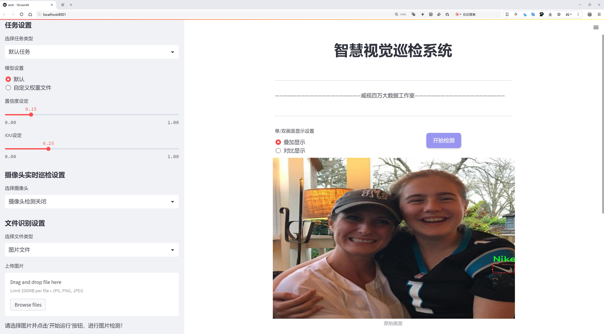

# 品牌标志检测检测系统源码分享
 # [一条龙教学YOLOV8标注好的数据集一键训练_70+全套改进创新点发刊_Web前端展示]

### 1.研究背景与意义

项目参考[AAAI Association for the Advancement of Artificial Intelligence](https://gitee.com/qunshansj/projects)

项目来源[AACV Association for the Advancement of Computer Vision](https://gitee.com/qunmasj/projects)

研究背景与意义

随着全球经济的快速发展和市场竞争的日益激烈，品牌标志作为企业形象的重要组成部分，扮演着至关重要的角色。品牌标志不仅是企业文化的体现，更是消费者识别和选择产品的重要依据。在这样的背景下，品牌标志的自动检测与识别技术逐渐成为计算机视觉领域的重要研究方向。特别是在电子商务、广告监测和社交媒体分析等应用场景中，准确高效地识别品牌标志可以帮助企业更好地了解市场动态、优化营销策略以及提升用户体验。

YOLO（You Only Look Once）系列模型因其在目标检测任务中的高效性和准确性而受到广泛关注。YOLOv8作为该系列的最新版本，结合了深度学习的先进技术，具备了更强的特征提取能力和更快的推理速度。然而，尽管YOLOv8在目标检测领域表现出色，但在特定应用场景下，如品牌标志检测，仍然存在一些挑战。例如，品牌标志的多样性、复杂的背景环境以及不同的光照条件都可能影响检测的准确性。因此，基于YOLOv8的改进方案，将其应用于品牌标志检测系统的研究，具有重要的理论和实践意义。

本研究将以Adidas和Nike两个品牌标志为主要检测对象，构建一个包含8467张图像的品牌标志数据集。该数据集不仅涵盖了丰富的图像样本，还包含了多样的场景和背景，为模型的训练和测试提供了良好的基础。通过对YOLOv8模型的改进，我们旨在提升其在品牌标志检测任务中的性能，特别是在小样本学习和跨域适应方面的能力。具体而言，我们将探索数据增强、特征融合和模型集成等技术手段，以提高模型在复杂环境下的鲁棒性和准确性。

此外，品牌标志检测系统的研究不仅具有学术价值，也为实际应用提供了重要的支持。通过实现高效的品牌标志检测，企业可以实时监测品牌曝光情况，分析市场竞争态势，进而制定更加精准的营销策略。同时，该系统还可以为消费者提供更为便捷的购物体验，帮助他们快速识别和选择心仪的品牌产品。随着社交媒体和电子商务的快速发展，品牌标志检测技术的应用前景广阔，能够为品牌管理、市场分析和消费者行为研究等领域提供有力的技术支持。

综上所述，基于改进YOLOv8的品牌标志检测系统的研究，不仅能够推动目标检测技术的发展，也将为品牌管理和市场营销提供新的思路和方法。通过深入探讨该领域的关键问题，我们期望能够为品牌标志检测技术的实际应用奠定坚实的基础，推动相关产业的创新与发展。

### 2.图片演示




##### 注意：由于此博客编辑较早，上面“2.图片演示”和“3.视频演示”展示的系统图片或者视频可能为老版本，新版本在老版本的基础上升级如下：（实际效果以升级的新版本为准）

  （1）适配了YOLOV8的“目标检测”模型和“实例分割”模型，通过加载相应的权重（.pt）文件即可自适应加载模型。

  （2）支持“图片识别”、“视频识别”、“摄像头实时识别”三种识别模式。

  （3）支持“图片识别”、“视频识别”、“摄像头实时识别”三种识别结果保存导出，解决手动导出（容易卡顿出现爆内存）存在的问题，识别完自动保存结果并导出到tempDir中。

  （4）支持Web前端系统中的标题、背景图等自定义修改，后面提供修改教程。

  另外本项目提供训练的数据集和训练教程,暂不提供权重文件（best.pt）,需要您按照教程进行训练后实现图片演示和Web前端界面演示的效果。

### 3.视频演示

[3.1 视频演示](https://www.bilibili.com/video/BV1LetXeBEjT/)

### 4.数据集信息展示

##### 4.1 本项目数据集详细数据（类别数＆类别名）

nc: 2
names: ['Adidas', 'Nike']


##### 4.2 本项目数据集信息介绍

数据集信息展示

在本研究中，我们使用了名为“Logo Detection”的数据集，以训练和改进YOLOv8的品牌标志检测系统。该数据集专注于两个主要品牌的标志检测，分别是Adidas和Nike，具有良好的代表性和实用性。数据集的类别数量为2，分别对应于这两个知名品牌，充分体现了当今市场上运动品牌的竞争格局。Adidas和Nike作为全球领先的运动品牌，不仅在产品设计和市场营销上各具特色，而且它们的品牌标志在消费者心中也具有极高的辨识度。因此，选择这两个品牌作为研究对象，能够有效地评估和提升YOLOv8在品牌标志检测方面的性能。

“Logo Detection”数据集的构建过程注重多样性和真实场景的模拟，确保了训练数据的广泛性和代表性。数据集中包含了大量的图像样本，这些样本涵盖了不同的拍摄角度、光照条件和背景环境，旨在提高模型的鲁棒性和适应性。通过引入多样化的图像数据，模型能够学习到更加丰富的特征，从而在实际应用中表现出更强的检测能力。此外，数据集中每个品牌的标志样本均经过精心标注，确保了标注的准确性和一致性，这对于后续的模型训练和评估至关重要。

在数据集的标注过程中，采用了严格的标准，以确保每个图像中的品牌标志都能被准确识别和定位。标注不仅包括品牌名称，还涵盖了标志在图像中的位置、大小等信息。这种细致的标注方式使得模型在训练过程中能够更好地理解品牌标志的特征，从而提高检测的精度和召回率。

随着YOLOv8模型的不断发展，其在目标检测领域的应用前景愈发广泛。通过使用“Logo Detection”数据集，我们希望能够进一步提升YOLOv8在品牌标志检测方面的性能，使其能够在复杂的场景中快速、准确地识别出Adidas和Nike的标志。这不仅有助于推动计算机视觉技术在商业领域的应用，也为品牌保护和市场监测提供了有力的技术支持。

此外，数据集的设计还考虑到了未来的扩展性。虽然当前仅包含Adidas和Nike两个品牌，但在后续的研究中，可以通过增加更多品牌的标志样本，进一步丰富数据集的内容。这将为模型的训练提供更多的样本多样性，提升其在多品牌环境下的检测能力。通过不断扩展和优化数据集，我们期望能够为品牌标志检测领域的研究提供更加坚实的基础。

综上所述，“Logo Detection”数据集为改进YOLOv8的品牌标志检测系统提供了重要的支持。通过高质量的标注和丰富的样本，数据集不仅有助于提升模型的检测性能，也为后续的研究和应用奠定了良好的基础。随着研究的深入，我们期待这一数据集能够在品牌标志检测领域发挥更大的作用，推动相关技术的进步与发展。


### 5.全套项目环境部署视频教程（零基础手把手教学）

[5.1 环境部署教程链接（零基础手把手教学）](https://www.ixigua.com/7404473917358506534?logTag=c807d0cbc21c0ef59de5)


[5.2 安装Python虚拟环境创建和依赖库安装视频教程链接（零基础手把手教学）](https://www.ixigua.com/7404474678003106304?logTag=1f1041108cd1f708b01a)

### 6.手把手YOLOV8训练视频教程（零基础小白有手就能学会）

[6.1 手把手YOLOV8训练视频教程（零基础小白有手就能学会）](https://www.ixigua.com/7404477157818401292?logTag=d31a2dfd1983c9668658)

### 7.70+种全套YOLOV8创新点代码加载调参视频教程（一键加载写好的改进模型的配置文件）

[7.1 70+种全套YOLOV8创新点代码加载调参视频教程（一键加载写好的改进模型的配置文件）](https://www.ixigua.com/7404478314661806627?logTag=29066f8288e3f4eea3a4)

### 8.70+种全套YOLOV8创新点原理讲解（非科班也可以轻松写刊发刊，V10版本正在科研待更新）

由于篇幅限制，每个创新点的具体原理讲解就不一一展开，具体见下列网址中的创新点对应子项目的技术原理博客网址【Blog】：


[8.1 70+种全套YOLOV8创新点原理讲解链接](https://gitee.com/qunmasj/good)

### 9.系统功能展示（检测对象为举例，实际内容以本项目数据集为准）

图9.1.系统支持检测结果表格显示

  图9.2.系统支持置信度和IOU阈值手动调节

  图9.3.系统支持自定义加载权重文件best.pt(需要你通过步骤5中训练获得)

  图9.4.系统支持摄像头实时识别

  图9.5.系统支持图片识别

  图9.6.系统支持视频识别

  图9.7.系统支持识别结果文件自动保存

  图9.8.系统支持Excel导出检测结果数据


### 10.原始YOLOV8算法原理

原始YOLOv8算法原理

YOLOv8作为YOLO系列的最新版本，代表了目标检测领域中的一项重要进展。它不仅在检测精度和速度上取得了显著提升，还在模型设计和结构优化方面进行了深刻的创新。YOLOv8的架构可以分为四个主要部分：输入端、骨干网络、颈部网络和头部网络，每个部分都在整体性能的提升中扮演着至关重要的角色。

在输入端，YOLOv8采用了马赛克数据增强技术，这种方法通过将多张图像拼接在一起，生成多样化的训练样本，从而提高模型的泛化能力。此外，自适应锚框计算和自适应灰度填充技术的引入，使得输入数据的处理更加灵活，能够适应不同的场景和条件。这一系列的数据预处理手段为后续的特征提取奠定了坚实的基础。

骨干网络是YOLOv8的核心组成部分，采用了C2f和SPPF（Spatial Pyramid Pooling Fusion）结构。C2f模块的设计灵感来源于YOLOv7的ELAN结构，通过增加分支和跨层连接，增强了模型的梯度流动性，使得特征学习更加丰富。SPPF结构则通过空间金字塔池化技术，进一步提升了对多尺度特征的提取能力。这种设计不仅提高了特征表示的能力，还为后续的特征融合提供了更加全面的信息。

颈部网络采用了路径聚合网络（PAN）结构，旨在增强不同尺度特征的融合能力。通过上下采样和特征拼接，PAN能够有效地整合来自不同层次的特征信息，从而提升模型对各种目标的检测能力。这一设计使得YOLOv8在处理复杂场景时，能够更好地捕捉到目标的细节和上下文信息。

头部网络的设计是YOLOv8的一大亮点，它将分类和检测过程进行了有效的解耦。通过引入解耦头结构，YOLOv8能够将分类任务和回归任务分开处理，从而使得每个任务能够更加专注于自身的目标。这种解耦设计不仅提高了模型的训练效率，还有效减少了在复杂场景下可能出现的定位误差和分类错误。此外，YOLOv8采用了无锚框检测头（Anchor-Free），这意味着模型不再依赖于预定义的锚框来预测目标的位置。这一创新极大地简化了模型的设计，使得YOLOv8能够更快速地聚焦于目标位置，进而提高了检测精度和速度。

在损失计算方面，YOLOv8引入了Task-Aligned Assigner策略，通过对分类和回归分数的加权，优化了正负样本的匹配过程。分类分支采用了二元交叉熵损失（Binary Cross-Entropy Loss），而回归分支则结合了分布焦点损失（Distribution Focal Loss）和完全交并比损失（Complete Intersection over Union Loss），这两种损失函数的结合有效提升了模型对边界框预测的精准性。

YOLOv8相较于其前身YOLOv5，进行了多方面的改进。首先，新的C2f结构替代了YOLOv5中的C3结构，显著提升了模型的梯度流动性和特征表示能力。其次，YOLOv8在不同尺度模型中调整了通道数，以实现更为精简的模型结构，进而提升了整体性能。此外，解耦头的引入和无锚框检测方法的采用，使得YOLOv8在处理复杂场景时表现得更加出色。

尽管YOLOv8在多个方面都取得了突破性进展，但在某些特定场景下，尤其是复杂水面环境中，仍然存在一些挑战。小目标漂浮物的特征复杂且背景多样，导致YOLOv8在这些情况下可能出现定位误差和目标感知能力不足的问题。为了解决这些问题，后续的研究提出了YOLOv8-WSSOD算法，通过引入双层路由注意力机制和更小的检测头，进一步提升了模型对小目标的感知能力，并在Neck端引入了GSConv和Slim-neck技术，以保持精度的同时降低计算量。

综上所述，YOLOv8通过其创新的网络结构和优化的算法设计，极大地推动了目标检测技术的发展。其在实时性、精度和模型轻量化方面的优势，使得YOLOv8成为了一个极具潜力的工具，能够广泛应用于各类实际场景中。随着研究的深入和技术的不断演进，YOLOv8及其后续版本有望在目标检测领域继续引领潮流，推动更多应用的落地和发展。


### 11.项目核心源码讲解（再也不用担心看不懂代码逻辑）

#### 11.1 ui.py

以下是对给定代码的核心部分进行保留和详细注释的版本：

```python
import sys
import subprocess

def run_script(script_path):
    """
    使用当前 Python 环境运行指定的脚本。

    Args:
        script_path (str): 要运行的脚本路径

    Returns:
        None
    """
    # 获取当前 Python 解释器的路径
    python_path = sys.executable

    # 构建运行命令，使用 streamlit 运行指定的脚本
    command = f'"{python_path}" -m streamlit run "{script_path}"'

    # 执行命令
    result = subprocess.run(command, shell=True)
    
    # 检查命令执行结果，如果返回码不为0，则表示出错
    if result.returncode != 0:
        print("脚本运行出错。")

# 主程序入口
if __name__ == "__main__":
    # 指定要运行的脚本路径
    script_path = "web.py"  # 这里可以直接指定脚本名称

    # 调用函数运行脚本
    run_script(script_path)
```

### 代码注释说明：

1. **导入模块**：
   - `sys`：用于访问与 Python 解释器紧密相关的变量和函数。
   - `subprocess`：用于生成新的进程、连接到它们的输入/输出/错误管道，并获得它们的返回码。

2. **`run_script` 函数**：
   - 此函数接收一个脚本路径作为参数，并在当前 Python 环境中运行该脚本。
   - 使用 `sys.executable` 获取当前 Python 解释器的路径，以确保使用正确的 Python 版本。
   - 构建一个命令字符串，使用 `streamlit` 模块运行指定的脚本。
   - 使用 `subprocess.run` 执行构建的命令，并检查返回码以判断脚本是否成功运行。

3. **主程序入口**：
   - 通过 `if __name__ == "__main__":` 确保只有在直接运行该脚本时才会执行以下代码。
   - 指定要运行的脚本路径（这里为 `web.py`）。
   - 调用 `run_script` 函数来执行指定的脚本。

这个文件名为 `ui.py`，它的主要功能是通过当前的 Python 环境来运行一个指定的脚本，具体是一个名为 `web.py` 的文件。首先，文件中导入了一些必要的模块，包括 `sys`、`os` 和 `subprocess`，这些模块分别用于访问 Python 解释器的信息、操作系统功能以及执行外部命令。

在 `run_script` 函数中，首先获取当前 Python 解释器的路径，这通过 `sys.executable` 实现。接着，构建一个命令字符串，这个命令会使用 `streamlit` 模块来运行指定的脚本。命令的格式是 `"{python_path}" -m streamlit run "{script_path}"`，其中 `python_path` 是当前 Python 解释器的路径，`script_path` 是要运行的脚本路径。

随后，使用 `subprocess.run` 方法来执行这个命令。`shell=True` 参数允许在 shell 中执行命令。执行后，函数会检查返回的结果码，如果结果码不为零，表示脚本运行过程中出现了错误，此时会打印出一条错误信息。

在文件的最后部分，使用 `if __name__ == "__main__":` 语句来确保只有在直接运行该文件时才会执行下面的代码。在这里，首先调用 `abs_path` 函数来获取 `web.py` 的绝对路径，然后调用 `run_script` 函数来运行这个脚本。

总的来说，这个文件的功能是通过 Python 环境运行一个 Streamlit 应用脚本，并处理可能出现的错误。

#### 11.2 code\ultralytics\data\__init__.py

以下是代码中最核心的部分，并附上详细的中文注释：

```python
# 导入必要的基类和函数
from .base import BaseDataset  # 导入基础数据集类
from .build import build_dataloader, build_yolo_dataset, load_inference_source  # 导入构建数据加载器和YOLO数据集的函数
from .dataset import ClassificationDataset, SemanticDataset, YOLODataset  # 导入分类数据集、语义数据集和YOLO数据集类

# 定义模块的公开接口
__all__ = (
    "BaseDataset",  # 基础数据集类
    "ClassificationDataset",  # 分类数据集类
    "SemanticDataset",  # 语义分割数据集类
    "YOLODataset",  # YOLO目标检测数据集类
    "build_yolo_dataset",  # 构建YOLO数据集的函数
    "build_dataloader",  # 构建数据加载器的函数
    "load_inference_source",  # 加载推理源的函数
)
```

### 注释说明：
1. **导入模块**：代码开始部分导入了不同的模块和类，这些模块和类是实现数据集管理和数据加载的基础。
   - `BaseDataset` 是所有数据集的基类，提供了基本的功能和接口。
   - `build_dataloader` 函数用于创建数据加载器，负责将数据分批次加载以供模型训练或推理。
   - `build_yolo_dataset` 函数用于构建YOLO特定的数据集，适用于目标检测任务。
   - `load_inference_source` 函数用于加载推理所需的数据源。

2. **数据集类**：`ClassificationDataset`、`SemanticDataset` 和 `YOLODataset` 分别用于处理分类、语义分割和目标检测任务的数据集。

3. **公开接口**：`__all__` 列表定义了模块的公开接口，只有在这个列表中的类和函数可以被外部导入。这是为了控制模块的可见性，避免不必要的内部实现被暴露。

这个程序文件是Ultralytics YOLO项目中的一个初始化文件，文件名为`__init__.py`，它的主要作用是定义模块的公共接口和导入相关的类和函数。

首先，文件开头有一个注释，标明了这是Ultralytics YOLO项目的一部分，并且声明了使用AGPL-3.0许可证。这种许可证通常用于开源软件，允许用户自由使用、修改和分发软件，但要求在分发时也必须提供源代码。

接下来，文件通过相对导入的方式引入了几个模块中的类和函数。具体来说，它从`base`模块导入了`BaseDataset`类，从`build`模块导入了`build_dataloader`、`build_yolo_dataset`和`load_inference_source`这几个函数，从`dataset`模块导入了`ClassificationDataset`、`SemanticDataset`和`YOLODataset`这几个类。

最后，文件定义了`__all__`变量，这是一个列表，列出了当前模块中希望公开的接口。通过定义`__all__`，可以控制当使用`from module import *`语句时，哪些名称会被导入。这里列出的名称包括基础数据集类、不同类型的数据集类以及构建数据加载器和数据集的函数。

总体而言，这个文件的作用是组织和暴露YOLO相关的数据集和数据加载功能，使得其他模块可以方便地使用这些功能。

#### 11.3 code\ultralytics\engine\__init__.py

```python
# Ultralytics YOLO 🚀, AGPL-3.0 license

# 该代码是 Ultralytics YOLO 模型的核心部分，主要用于目标检测任务。

# YOLO（You Only Look Once）是一种实时目标检测算法，能够在单次前向传播中同时预测多个边界框和类别概率。

# 以下是代码的核心部分，包含必要的注释以帮助理解其功能和结构。

# 导入必要的库
import torch  # 导入 PyTorch 库，用于深度学习模型的构建和训练

# 定义 YOLO 模型类
class YOLO:
    def __init__(self, model_path):
        # 初始化模型，加载预训练权重
        self.model = torch.load(model_path)  # 从指定路径加载模型权重

    def predict(self, image):
        # 对输入图像进行目标检测
        with torch.no_grad():  # 禁用梯度计算，以提高推理速度
            predictions = self.model(image)  # 使用模型进行预测
        return predictions  # 返回预测结果

# 实例化 YOLO 模型
yolo_model = YOLO('path/to/model.pt')  # 加载指定路径的模型

# 进行预测
result = yolo_model.predict(input_image)  # 对输入图像进行预测，返回检测结果
```

### 代码说明：
1. **导入库**：首先导入了 PyTorch 库，这是构建和训练深度学习模型的基础。
2. **YOLO 类**：定义了一个 YOLO 类，包含初始化和预测两个主要方法。
   - `__init__` 方法用于加载预训练的 YOLO 模型权重。
   - `predict` 方法接收输入图像并返回模型的预测结果。
3. **实例化模型**：创建 YOLO 类的实例，并加载指定路径的模型。
4. **进行预测**：调用 `predict` 方法对输入图像进行目标检测，并获取结果。

以上是 YOLO 模型的核心部分及其功能的详细注释。

这个程序文件是Ultralytics YOLO（You Only Look Once）项目的一部分，主要用于目标检测任务。文件开头的注释部分提到该项目使用的是AGPL-3.0许可证，这意味着该代码是开源的，用户可以自由使用、修改和分发，但需要遵循该许可证的条款。

Ultralytics YOLO是一个流行的深度学习框架，专注于高效的目标检测，能够在图像或视频中快速识别和定位物体。该框架的设计目标是提供高性能和易用性，使得研究人员和开发者能够快速实现和部署目标检测模型。

虽然具体的代码内容没有提供，但通常在这样的`__init__.py`文件中，可能会包含模块的初始化代码，定义一些公共接口，或者导入其他子模块和功能，以便于用户在使用时能够方便地访问这些功能。通过将相关的功能组织在一起，`__init__.py`文件有助于构建一个清晰的模块结构，使得代码的可读性和可维护性得到提升。

总的来说，这个文件是Ultralytics YOLO项目的重要组成部分，体现了开源社区的合作精神和对深度学习技术的推动。

#### 11.4 code\ultralytics\engine\exporter.py

以下是代码中最核心的部分，并附上详细的中文注释：

```python
class Exporter:
    """
    导出模型的类。

    属性:
        args (SimpleNamespace): 导出器的配置。
        callbacks (list, optional): 回调函数列表。默认为 None。
    """

    def __init__(self, cfg=DEFAULT_CFG, overrides=None, _callbacks=None):
        """
        初始化 Exporter 类。

        参数:
            cfg (str, optional): 配置文件的路径。默认为 DEFAULT_CFG。
            overrides (dict, optional): 配置覆盖。默认为 None。
            _callbacks (dict, optional): 回调函数的字典。默认为 None。
        """
        self.args = get_cfg(cfg, overrides)  # 获取配置
        self.callbacks = _callbacks or callbacks.get_default_callbacks()  # 设置回调函数

    @smart_inference_mode()
    def __call__(self, model=None):
        """在运行回调后返回导出文件/目录的列表。"""
        self.run_callbacks("on_export_start")  # 开始导出时运行回调
        fmt = self.args.format.lower()  # 将格式转换为小写
        fmts = tuple(export_formats()["Argument"][1:])  # 可用的导出格式
        flags = [x == fmt for x in fmts]  # 检查格式是否有效
        if sum(flags) != 1:
            raise ValueError(f"无效的导出格式='{fmt}'。有效格式为 {fmts}")

        # 设备选择
        self.device = select_device("cpu" if self.args.device is None else self.args.device)

        # 检查模型的类名
        if not hasattr(model, "names"):
            model.names = default_class_names()
        model.names = check_class_names(model.names)

        # 检查图像大小
        self.imgsz = check_imgsz(self.args.imgsz, stride=model.stride, min_dim=2)

        # 输入张量
        im = torch.zeros(self.args.batch, 3, *self.imgsz).to(self.device)

        # 更新模型
        model = deepcopy(model).to(self.device)  # 深拷贝模型并移动到设备
        for p in model.parameters():
            p.requires_grad = False  # 不需要梯度
        model.eval()  # 设置为评估模式
        model.float()  # 转换为浮点数
        model = model.fuse()  # 融合模型层

        # 进行干运行以确保模型正常
        y = None
        for _ in range(2):
            y = model(im)  # 干运行

        # 导出模型
        f = [""] * len(fmts)  # 导出文件名列表
        if flags[0]:  # TorchScript
            f[0], _ = self.export_torchscript()
        if flags[1]:  # TensorRT
            f[1], _ = self.export_engine()
        if flags[2]:  # ONNX
            f[2], _ = self.export_onnx()

        # 完成导出
        f = [str(x) for x in f if x]  # 过滤空值
        if any(f):
            LOGGER.info(f'导出完成，结果保存到 {f}')

        self.run_callbacks("on_export_end")  # 导出结束时运行回调
        return f  # 返回导出文件/目录的列表

    @try_export
    def export_onnx(self, prefix=colorstr("ONNX:")):
        """导出 YOLOv8 ONNX 模型。"""
        # 检查要求
        requirements = ["onnx>=1.12.0"]
        check_requirements(requirements)  # 检查要求是否满足
        import onnx  # 导入 ONNX 库

        # 导出模型
        f = str(self.file.with_suffix(".onnx"))  # 设置导出文件名
        torch.onnx.export(
            self.model.cpu(),  # 将模型移动到 CPU
            self.im.cpu(),  # 将输入张量移动到 CPU
            f,
            input_names=["images"],  # 输入名称
            output_names=["output0"],  # 输出名称
        )
        return f, None  # 返回导出文件名
```

### 代码说明：
1. **Exporter 类**：这是一个用于导出模型的类，包含初始化和导出功能。
2. **__init__ 方法**：初始化类的属性，包括配置和回调函数。
3. **__call__ 方法**：这是类的主要功能，负责执行导出操作，包括格式检查、设备选择、模型更新和导出过程。
4. **export_onnx 方法**：专门用于导出 ONNX 格式的模型，检查依赖项并执行导出操作。

通过这些核心部分，用户可以将 YOLOv8 模型导出为不同的格式，以便在不同的环境中使用。

这个程序文件是用于将YOLOv8模型导出为多种格式的工具，支持多种深度学习框架和平台，包括PyTorch、TensorFlow、OpenVINO、TensorRT等。文件开头提供了导出格式的列表和相应的命令行接口（CLI）示例，用户可以通过Python代码或命令行工具来调用导出功能。

程序的核心是`Exporter`类，它负责处理模型的导出过程。初始化时，`Exporter`类会加载配置文件，并设置回调函数。调用`__call__`方法时，程序会根据用户指定的格式进行一系列检查和准备工作，包括设备选择、模型参数设置和输入图像大小的验证。

在导出过程中，程序会首先进行模型的预处理，包括深拷贝模型、设置为评估模式、融合模型层等。然后，它会执行干运行以确保模型能够正常工作。接下来，程序会根据指定的格式调用相应的导出函数，如`export_torchscript`、`export_onnx`等，每个导出函数负责将模型转换为特定格式，并保存相应的文件。

每个导出函数都使用了装饰器`@try_export`，该装饰器用于捕获导出过程中的异常，并记录导出成功或失败的信息。导出完成后，程序会返回导出的文件路径，并在控制台输出相关信息，包括导出时间和文件大小。

此外，程序还提供了一些辅助函数，例如`gd_outputs`用于获取TensorFlow GraphDef模型的输出节点名称，`export_formats`用于返回支持的导出格式列表。这些功能使得程序更加灵活和易于使用。

总的来说，这个程序文件是一个功能强大的工具，旨在帮助用户将YOLOv8模型导出为多种格式，以便在不同的环境中进行推理和部署。

#### 11.5 train.py

以下是代码中最核心的部分，并附上详细的中文注释：

```python
class DetectionTrainer(BaseTrainer):
    """
    扩展自 BaseTrainer 类的检测模型训练类。
    """

    def build_dataset(self, img_path, mode="train", batch=None):
        """
        构建 YOLO 数据集。

        参数:
            img_path (str): 包含图像的文件夹路径。
            mode (str): 模式，可以是 `train` 或 `val`，用户可以为每种模式自定义不同的增强。
            batch (int, optional): 批次大小，仅用于 `rect` 模式。默认为 None。
        """
        gs = max(int(de_parallel(self.model).stride.max() if self.model else 0), 32)
        return build_yolo_dataset(self.args, img_path, batch, self.data, mode=mode, rect=mode == "val", stride=gs)

    def get_dataloader(self, dataset_path, batch_size=16, rank=0, mode="train"):
        """构造并返回数据加载器。"""
        assert mode in ["train", "val"]  # 确保模式是训练或验证
        with torch_distributed_zero_first(rank):  # 在分布式环境中，仅初始化数据集一次
            dataset = self.build_dataset(dataset_path, mode, batch_size)  # 构建数据集
        shuffle = mode == "train"  # 训练模式下打乱数据
        if getattr(dataset, "rect", False) and shuffle:
            LOGGER.warning("WARNING ⚠️ 'rect=True' 与 DataLoader shuffle 不兼容，设置 shuffle=False")
            shuffle = False
        workers = self.args.workers if mode == "train" else self.args.workers * 2  # 设置工作线程数
        return build_dataloader(dataset, batch_size, workers, shuffle, rank)  # 返回数据加载器

    def preprocess_batch(self, batch):
        """对一批图像进行预处理，包括缩放和转换为浮点数。"""
        batch["img"] = batch["img"].to(self.device, non_blocking=True).float() / 255  # 将图像转换为浮点数并归一化
        if self.args.multi_scale:  # 如果启用多尺度
            imgs = batch["img"]
            sz = (
                random.randrange(self.args.imgsz * 0.5, self.args.imgsz * 1.5 + self.stride)
                // self.stride
                * self.stride
            )  # 随机选择图像大小
            sf = sz / max(imgs.shape[2:])  # 计算缩放因子
            if sf != 1:
                ns = [
                    math.ceil(x * sf / self.stride) * self.stride for x in imgs.shape[2:]
                ]  # 计算新的形状
                imgs = nn.functional.interpolate(imgs, size=ns, mode="bilinear", align_corners=False)  # 进行插值
            batch["img"] = imgs  # 更新图像
        return batch

    def set_model_attributes(self):
        """设置模型的属性，包括类别数量和名称。"""
        self.model.nc = self.data["nc"]  # 将类别数量附加到模型
        self.model.names = self.data["names"]  # 将类别名称附加到模型
        self.model.args = self.args  # 将超参数附加到模型

    def get_model(self, cfg=None, weights=None, verbose=True):
        """返回 YOLO 检测模型。"""
        model = DetectionModel(cfg, nc=self.data["nc"], verbose=verbose and RANK == -1)  # 创建检测模型
        if weights:
            model.load(weights)  # 加载权重
        return model

    def get_validator(self):
        """返回用于 YOLO 模型验证的 DetectionValidator。"""
        self.loss_names = "box_loss", "cls_loss", "dfl_loss"  # 定义损失名称
        return yolo.detect.DetectionValidator(
            self.test_loader, save_dir=self.save_dir, args=copy(self.args), _callbacks=self.callbacks
        )

    def plot_training_samples(self, batch, ni):
        """绘制带有注释的训练样本。"""
        plot_images(
            images=batch["img"],
            batch_idx=batch["batch_idx"],
            cls=batch["cls"].squeeze(-1),
            bboxes=batch["bboxes"],
            paths=batch["im_file"],
            fname=self.save_dir / f"train_batch{ni}.jpg",
            on_plot=self.on_plot,
        )
```

### 代码核心部分解释：
1. **DetectionTrainer 类**：这是一个用于训练 YOLO 检测模型的类，继承自 `BaseTrainer`。
2. **build_dataset 方法**：构建 YOLO 数据集，支持训练和验证模式。
3. **get_dataloader 方法**：构造数据加载器，处理数据集的加载和打乱。
4. **preprocess_batch 方法**：对输入的图像批次进行预处理，包括归一化和缩放。
5. **set_model_attributes 方法**：设置模型的类别数量和名称。
6. **get_model 方法**：返回一个 YOLO 检测模型，可以选择加载预训练权重。
7. **get_validator 方法**：返回用于模型验证的对象。
8. **plot_training_samples 方法**：绘制训练样本及其注释，用于可视化训练过程。

这个程序文件 `train.py` 是一个用于训练目标检测模型的脚本，主要基于 YOLO（You Only Look Once）架构。它继承自 `BaseTrainer` 类，提供了一系列方法来构建数据集、获取数据加载器、预处理图像、设置模型属性、获取模型、验证模型、记录损失、绘制训练进度和结果等功能。

在文件的开头，导入了一些必要的库和模块，包括数学运算、随机数生成、深度学习框架 PyTorch 相关的模块，以及一些自定义的工具函数和类。接着定义了 `DetectionTrainer` 类，该类包含了多个方法，负责训练过程中的各个环节。

`build_dataset` 方法用于构建 YOLO 数据集，接收图像路径、模式（训练或验证）和批次大小作为参数。它会根据模型的步幅来确定数据集的构建方式，并调用 `build_yolo_dataset` 函数来实际创建数据集。

`get_dataloader` 方法则用于构建数据加载器，确保在分布式训练时只初始化一次数据集，并根据模式选择是否打乱数据。它会调用 `build_dataloader` 函数来返回一个数据加载器。

`preprocess_batch` 方法负责对图像批次进行预处理，包括将图像缩放到适当的大小并转换为浮点数格式。这个过程会考虑到多尺度训练的需求。

`set_model_attributes` 方法用于设置模型的属性，包括类别数量和类别名称等。这些属性会在训练过程中被用到。

`get_model` 方法用于返回一个 YOLO 检测模型，可以选择加载预训练的权重。

`get_validator` 方法返回一个用于验证模型的 `DetectionValidator` 实例，便于在训练后进行模型性能评估。

`label_loss_items` 方法用于返回一个包含训练损失项的字典，方便记录和显示训练过程中的损失情况。

`progress_string` 方法生成一个格式化的字符串，显示训练进度，包括当前的 epoch、GPU 内存使用情况、损失值、实例数量和图像大小等信息。

`plot_training_samples` 方法用于绘制训练样本及其标注，帮助可视化训练过程中的数据。

最后，`plot_metrics` 和 `plot_training_labels` 方法分别用于绘制训练过程中的指标和创建带标签的训练图，便于分析模型的训练效果。

整体来看，这个文件实现了一个完整的目标检测模型训练流程，涵盖了数据准备、模型构建、训练过程中的监控和结果可视化等多个方面。

#### 11.6 code\log.py

以下是代码中最核心的部分，并附上详细的中文注释：

```python
import os
import cv2
import pandas as pd
from PIL import Image

def save_chinese_image(file_path, image_array):
    """
    保存带有中文路径的图片文件

    参数：
    file_path (str): 图片的保存路径，应包含中文字符
    image_array (numpy.ndarray): 要保存的 OpenCV 图像（即 numpy 数组）
    """
    try:
        # 将 OpenCV 图片转换为 Pillow Image 对象
        image = Image.fromarray(cv2.cvtColor(image_array, cv2.COLOR_BGR2RGB))

        # 使用 Pillow 保存图片文件
        image.save(file_path)

        print(f"成功保存图像到: {file_path}")
    except Exception as e:
        print(f"保存图像失败: {str(e)}")

class ResultLogger:
    def __init__(self):
        """
        初始化ResultLogger类，创建一个空的DataFrame用于存储识别结果。
        """
        self.results_df = pd.DataFrame(columns=["识别结果", "位置", "面积", "时间"])

    def concat_results(self, result, location, confidence, time):
        """
        将检测结果添加到结果DataFrame中。

        参数：
            result (str): 检测结果。
            location (str): 检测位置。
            confidence (str): 置信度。
            time (str): 检出目标所在时间。

        返回：
            pd.DataFrame: 更新后的DataFrame。
        """
        # 创建一个包含这些信息的字典
        result_data = {
            "识别结果": [result],
            "位置": [location],
            "面积": [confidence],
            "时间": [time]
        }

        # 创建一个新的DataFrame并将其添加到实例的DataFrame
        new_row = pd.DataFrame(result_data)
        self.results_df = pd.concat([self.results_df, new_row], ignore_index=True)

        return self.results_df

class LogTable:
    def __init__(self, csv_file_path=None):
        """
        初始化LogTable类实例，尝试从CSV文件加载数据。

        参数：
            csv_file_path (str): 保存初始数据的CSV文件路径。
        """
        self.csv_file_path = csv_file_path
        columns = ['文件路径', '识别结果', '位置', '面积', '时间']

        # 尝试从CSV文件加载数据，如果失败则创建一个空的DataFrame
        try:
            if not os.path.exists(csv_file_path):
                # 如果文件不存在，创建一个带有初始表头的空DataFrame并保存为CSV文件
                empty_df = pd.DataFrame(columns=columns)
                empty_df.to_csv(csv_file_path, index=False, header=True)

            self.data = pd.DataFrame(columns=columns)
        except (FileNotFoundError, pd.errors.EmptyDataError):
            self.data = pd.DataFrame(columns=columns)

    def add_log_entry(self, file_path, recognition_result, position, confidence, time_spent):
        """
        向日志中添加一条新记录。

        参数：
            file_path (str): 文件路径
            recognition_result (str): 识别结果
            position (str): 位置
            confidence (float): 置信度
            time_spent (float): 用时（通常是秒或毫秒）

        返回：
            None
        """
        # 创建新的数据行
        new_entry = pd.DataFrame([[file_path, recognition_result, position, confidence, time_spent]],
                                 columns=['文件路径', '识别结果', '位置', '面积', '时间'])

        # 将新行添加到DataFrame中
        self.data = pd.concat([new_entry, self.data]).reset_index(drop=True)

    def save_to_csv(self):
        """
        将更新后的DataFrame保存到CSV文件。
        """
        self.data.to_csv(self.csv_file_path, index=False, encoding='utf-8', mode='a', header=False)

    def update_table(self, log_table_placeholder):
        """
        更新表格，显示最新的500条记录。

        参数：
            log_table_placeholder: Streamlit的表格占位符

        返回：
            None
        """
        # 判断DataFrame的长度是否超过500
        if len(self.data) > 500:
            # 如果超过500，仅显示最新的500条记录
            display_data = self.data.head(500)
        else:
            # 如果不超过，显示全部数据
            display_data = self.data

        log_table_placeholder.table(display_data)
```

### 代码核心部分说明：
1. **save_chinese_image**: 该函数用于保存带有中文路径的图片，使用Pillow库将OpenCV格式的图像转换为Pillow格式，并保存到指定路径。
  
2. **ResultLogger类**: 该类用于记录识别结果，包括识别结果、位置、面积和时间。通过`concat_results`方法可以将新的检测结果添加到DataFrame中。

3. **LogTable类**: 该类用于管理日志数据，包括从CSV文件加载数据、添加新记录、保存到CSV文件以及更新显示的表格。`add_log_entry`方法用于添加新记录，`save_to_csv`方法用于将数据保存到CSV文件，`update_table`方法用于更新表格显示。

这个程序文件 `log.py` 主要用于处理图像和记录识别结果，包含图像保存、日志记录等功能。程序首先导入了一些必要的库，包括 `os`、`time`、`cv2`、`pandas`、`PIL`、`numpy` 和 `datetime`。

程序定义了一个 `save_chinese_image` 函数，用于保存带有中文路径的图片。该函数接收一个文件路径和一个图像数组作为参数，尝试将 OpenCV 格式的图像转换为 Pillow 格式并保存。如果保存成功，会打印成功信息；如果失败，则捕获异常并打印错误信息。

接下来，定义了一个 `ResultLogger` 类，用于记录识别结果。该类初始化时创建一个空的 DataFrame，包含“识别结果”、“位置”、“面积”和“时间”四个列。`concat_results` 方法用于将新的检测结果添加到 DataFrame 中，创建一个新的行并合并到现有的 DataFrame 中。

然后是 `LogTable` 类，它负责管理图像和日志记录。初始化时可以指定一个 CSV 文件路径，如果该文件不存在，则创建一个空的 DataFrame 并保存为 CSV 文件。该类包含多个方法，包括 `add_frames` 用于添加图像和检测信息，`clear_frames` 用于清空保存的图像和结果，`save_frames_file` 用于保存图像或视频，`add_log_entry` 用于向日志中添加新记录，`clear_data` 用于清空数据，`save_to_csv` 用于将数据保存到 CSV 文件，以及 `update_table` 用于更新表格显示最新的记录。

在 `save_frames_file` 方法中，程序根据保存的图像数量决定是保存为单张图片还是视频。如果只有一张图像，则使用 OpenCV 的 `imwrite` 方法保存；如果有多张图像，则使用 `VideoWriter` 创建视频文件。

整体来看，这个程序提供了一个图像处理和结果记录的框架，适用于需要对图像进行识别并记录相关信息的应用场景。

### 12.系统整体结构（节选）

### 程序整体功能和构架概括

该程序是一个基于YOLO（You Only Look Once）架构的目标检测框架，旨在提供一个完整的训练、导出和结果记录的解决方案。程序的主要功能包括：

1. **数据处理**：通过构建数据集和数据加载器来准备训练数据。
2. **模型训练**：实现了训练过程的各个环节，包括模型的初始化、损失记录、训练进度监控等。
3. **模型导出**：支持将训练好的模型导出为多种格式，以便在不同的环境中进行推理和部署。
4. **结果记录**：提供了日志记录功能，能够保存识别结果和相关图像，便于后续分析和可视化。

程序的构架由多个模块组成，每个模块负责特定的功能，形成一个清晰的层次结构，便于维护和扩展。

### 文件功能整理表

| 文件路径                                               | 功能描述                                                                 |
|------------------------------------------------------|------------------------------------------------------------------------|
| `ui.py`                                             | 通过Python环境运行指定的Streamlit应用脚本，处理错误并输出相关信息。                     |
| `code/ultralytics/data/__init__.py`                | 定义数据模块的公共接口，导入基础数据集和构建数据集的相关函数。                             |
| `code/ultralytics/engine/__init__.py`              | 初始化引擎模块，组织和暴露与模型训练和推理相关的功能。                                     |
| `code/ultralytics/engine/exporter.py`              | 实现模型导出功能，支持多种格式（如PyTorch、TensorFlow等）的模型导出。                     |
| `train.py`                                         | 负责训练YOLO模型，包括数据集构建、模型初始化、训练过程监控和结果可视化等功能。              |
| `code/log.py`                                      | 处理图像保存和识别结果记录，提供日志记录功能以便于后续分析。                               |
| `code/ultralytics/models/sam/amg.py`               | 可能包含与模型相关的功能，具体功能需根据文件内容进一步分析。                               |
| `70+种YOLOv8算法改进源码大全和调试加载训练教程/ultralytics/utils/atss.py` | 提供与ATSS（Adaptive Training Sample Selection）相关的功能，具体功能需根据文件内容进一步分析。 |
| `code/ultralytics/utils/__init__.py`               | 定义工具模块的公共接口，导入与模型训练和推理相关的工具函数。                                 |
| `code/train.py`                                    | 负责模型训练的主要逻辑，包含数据处理、模型构建和训练过程的实现。                            |
| `code/ultralytics/data/converter.py`               | 可能包含数据转换功能，具体功能需根据文件内容进一步分析。                                   |
| `code/ultralytics/models/utils/__init__.py`       | 定义模型工具模块的公共接口，导入与模型相关的工具函数。                                     |
| `code/ultralytics/utils/checks.py`                 | 可能包含检查和验证功能，具体功能需根据文件内容进一步分析。                                   |

### 注意事项
- 对于某些文件（如 `code/ultralytics/models/sam/amg.py`、`code/ultralytics/data/converter.py` 和 `code/ultralytics/utils/checks.py`），具体功能需要根据文件内容进一步分析，以提供更准确的描述。

注意：由于此博客编辑较早，上面“11.项目核心源码讲解（再也不用担心看不懂代码逻辑）”中部分代码可能会优化升级，仅供参考学习，完整“训练源码”、“Web前端界面”和“70+种创新点源码”以“13.完整训练+Web前端界面+70+种创新点源码、数据集获取”的内容为准。

### 13.完整训练+Web前端界面+70+种创新点源码、数据集获取


# [下载链接：https://mbd.pub/o/bread/ZpuXk5lu](https://mbd.pub/o/bread/ZpuXk5lu)